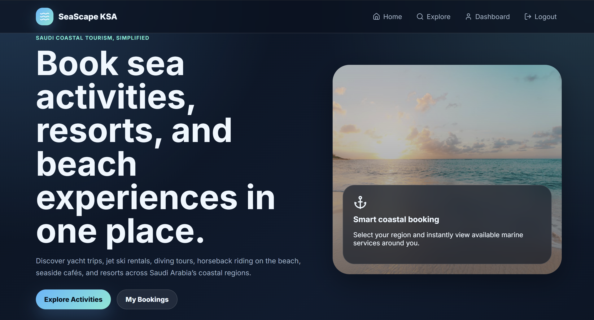
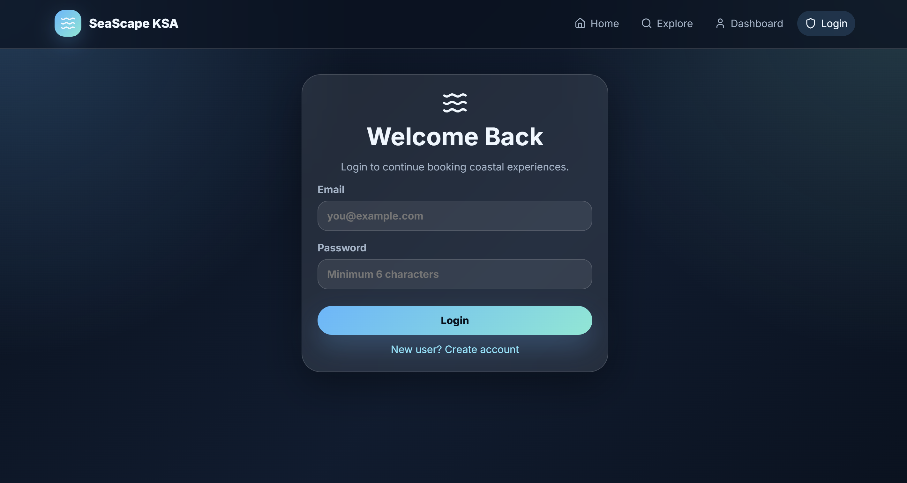
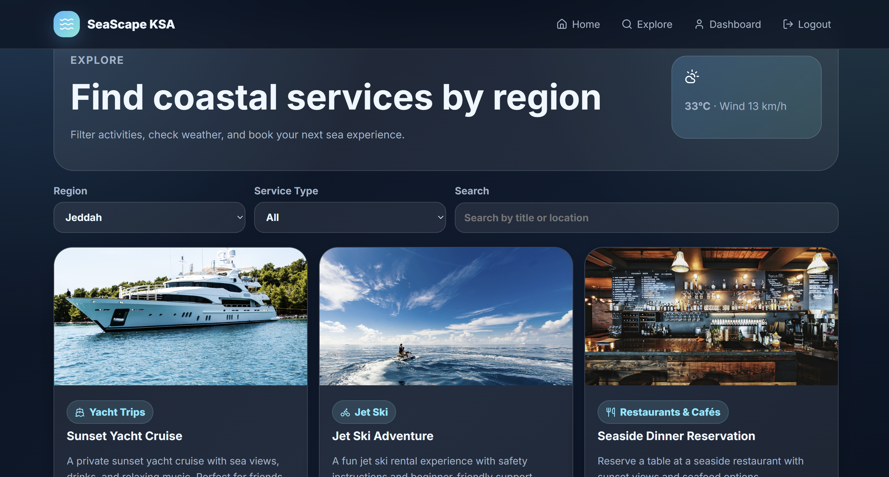
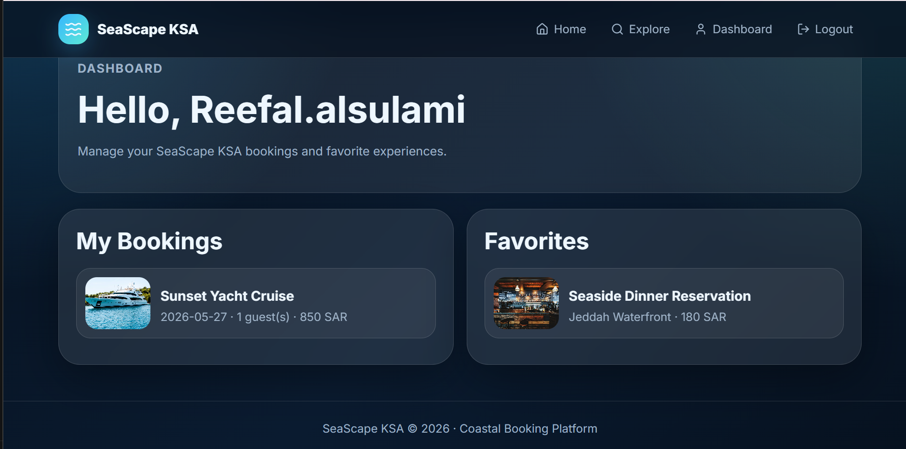
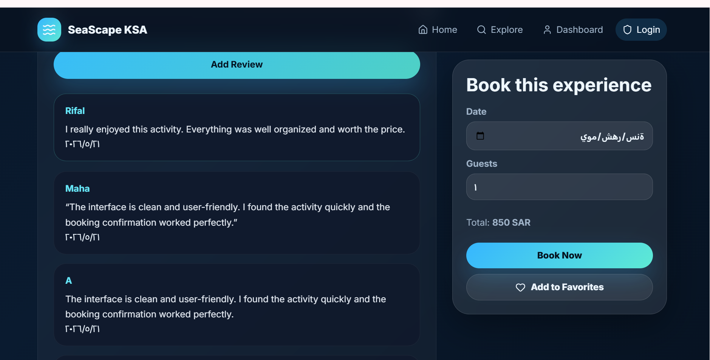
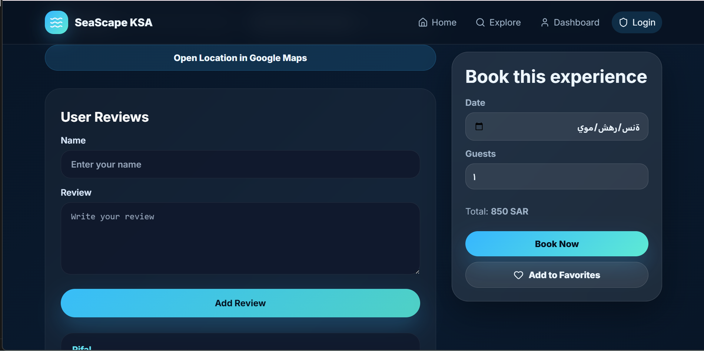
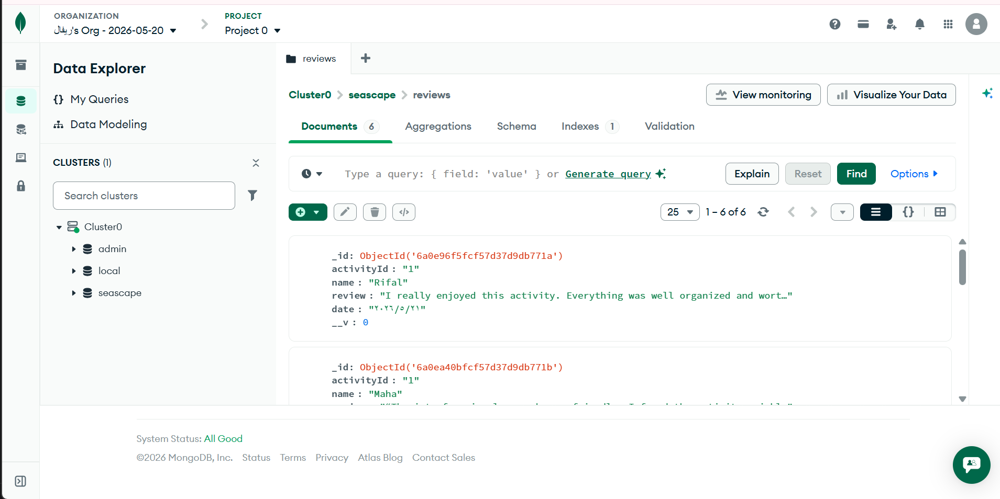

# SeaScape KSA – Coastal Booking Platform

React-based tourism web app for discovering and booking coastal/marine services in Saudi Arabia.

## Features
- User registration and login
- Protected routes
- Region-based filtering
- Search and service filtering
- Activity details page
- Booking system
- Favorites system
- User dashboard
- Weather API integration using Open-Meteo
- Google Maps location link
- Responsive UI
- MongoDB review system

## Run

```bash
npm install
npm run dev
```

## Live Demo

Vercel:
https://seascape-ksa-reviews.vercel.app

## Screenshots

### Home Page


### Login Page


### Explore Page


### Dashboard Page


### Activity Details Page


### Reviews System


### MongoDB Database

